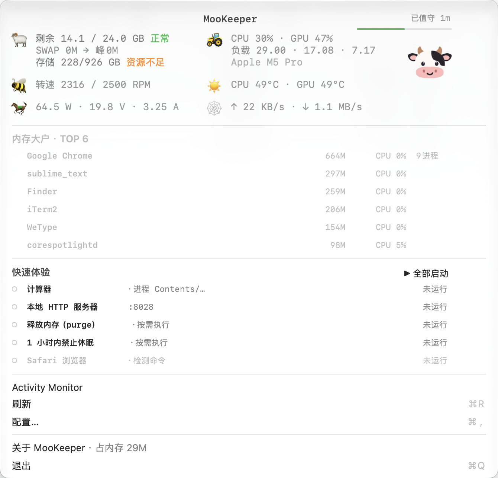

# 🐮 MooKeeper · 看门牛

> **一只住在 macOS 菜单栏里的小牛。它会“哞”，也会帮你看着 Mac。**

[English](#english) · [License: MIT](LICENSE)

MooKeeper 是一个原生 macOS 菜单栏小工具。它不会试图变成完整的系统监控平台，只做一件很日常、但很有用的事：

**你不用一直看着 Mac。看门牛替你看着。**

<picture>
  <source media="(prefers-color-scheme: dark)" srcset="docs/screenshots/menu-dark-zh.png">
  
</picture>

## Why / 起因

MooKeeper 是从一个很个人的需求里长出来的。

我只是想随时知道我的 Mac 现在怎么样。

有时候 Wi-Fi 和网线都连着，但我很在意当前真正走的是哪条网络。是无线？有线？还是雷雳桥接？我想一眼看到。

我也有很多脚本、服务、本地模型项目在跑。有些不是我手动打开的，而是被 hook、脚本或后台流程触发的。它们什么时候在跑、有没有真的停掉，我不想靠猜。

但我又不可能一直盯着菜单栏。

所以 MooKeeper 会待在菜单栏里帮我看着：需要我注意的时候，就用系统通知和一声“哞”提醒我。

至于为什么是牛？因为我喜欢牛，也喜欢牛叫。于是这些小故事就被揉进了这个工具里：它不是冷冰冰的监控面板，而是一只会看门、会提醒、平时安静待着的小牛。

## What It Does

MooKeeper 会在菜单栏里显示 Mac 的状态，并把常用操作收在一个地方：

- 看内存、SWAP、内存压力和内存大户
- 看 CPU / GPU、温度、功率和风扇
- 看当前主要网络通路更像 Wi-Fi、有线网卡，还是雷雳通道
- 看脚本、服务、本地模型是否正在运行
- 一键启动、停止、切换，或按分组批量启动 / 停止
- 用系统通知和声音提醒失败、超时、内存预警等情况

它的定位不是性能探针，也不是专业压测工具。MooKeeper 更像一个低频、低打扰的状态看板：告诉你 Mac 大概处在什么状态，并在需要的时候帮你点一下开关。

## 菜单栏里看到什么？

菜单栏默认只占一个位置，显示剩余可用内存的整数 GB。颜色会跟随内存压力变化：

- 绿色：状态正常
- 橙色：需要留意
- 红色：内存吃紧

点开菜单后，主角也会出现：小牛旁边有一条 **5 秒进度线**。时间走完，它就眨一次眼，重新确认农场状态。

那条线在动，就表示看门牛正在巡逻。

菜单里还会显示一块小小的“农场巡视牌”：🐏 资源够不够，🚜 机器忙不忙，🐝 风扇嗡不嗡，☀️ 热不热，🐎 马力多大，🚚 货物进出多少。下面再告诉你：**到底是谁吃掉了这些资源**。

顶部的网络图标会尽量反映当前主力网络通路：📡 是 Wi-Fi，🕸️ 是有线网络，⚡️ 是雷雳 / 高速通道；如果有网络但无法可靠判断，就退回 🚚。上下行流量是所有网卡合计值，网络图标只表达“系统当前主要像在走哪条路”。

这些小设定不会影响功能，但会让 MooKeeper 更像一只真的“看门牛”：平时在农场里巡逻，有事就叫你一声。

## 安装

MooKeeper 目前推荐从源码在本机编译安装。你只需要 Xcode Command Line Tools，不需要完整 Xcode。

```bash
# 一行安装：clone → build → install 到 ~/Applications → 启动
curl -fsSL https://raw.githubusercontent.com/windy20000/mookeeper/main/install-remote.sh | bash

# 安装并注册登录自启
curl -fsSL https://raw.githubusercontent.com/windy20000/mookeeper/main/install-remote.sh | bash -s -- --autostart
```

也可以自己 clone 后安装：

```bash
git clone https://github.com/windy20000/mookeeper.git
cd mookeeper
./build.sh
./install.sh
```

Homebrew：

```bash
brew tap windy20000/tap
brew install windy20000/tap/mookeeper
```

要求：

- macOS 14+
- Xcode Command Line Tools：`xcode-select --install`

菜单栏出现内存数字，就说明 MooKeeper 已经跑起来了。

卸载：`./scripts/uninstall.sh`（停进程、摘登录自启、删 App；配置和提示音默认保留，加 `--purge` 一并删除）。

## 配置

MooKeeper 第一次启动时，如果还没有 `config.json`，会自动放一份示例配置到本机配置目录。已有配置不会被覆盖。

你可以用两种方式配置它：

- 打开菜单里的 **配置…**（或按 `⌘,`）用图形界面编辑
- 直接编辑 `config.json`

配置里最重要的是 `groups`：你可以把自己的脚本、服务、本地模型、动作按钮放进不同分组。每个条目可以配置：

- 怎么判断它是否正在运行：端口、进程、PID 文件或自定义检查命令
- 怎么启动 / 停止
- 是否需要启动前检查剩余内存
- 是否启动完成后播放一声牛叫
- 是否提供“打开网页”入口

完整字段说明、更多示例和高级用法建议放在 `docs/` 里维护，例如：

- `docs/config.example.json`
- `docs/AI_CONFIG_GUIDE.md`

README 首页只保留最常用的信息，避免把第一次看到项目的人淹没在字段表里。

## 声音提醒

MooKeeper 的提醒原则是：**平时安静，有事才哞。**

它会通过 macOS 系统通知提醒你：

- 启动 / 停止完成
- 启动 / 停止失败
- 操作超时
- 剩余内存不足，拒绝启动
- 内存预警或告急

默认只有失败、超时、内存预警这类需要注意的事情会播放声音。对于启动慢的服务或本地模型，你可以单独开启“启动完成响哞”，这样点完启动就可以走开，听到“哞”就知道它好了。

首次使用通知时，请在配置窗口里请求通知权限；如果之前拒绝过，需要到系统设置里的“通知”重新允许 MooKeeper。

## 适合谁？

MooKeeper 可能适合你，如果你：

- 经常在 Mac 上跑脚本、服务、本地模型或开发环境
- 想知道某些服务到底有没有在运行
- 想一眼确认当前主要走 Wi-Fi 还是有线网络
- 不想一直盯着活动监视器
- 喜欢一点点不那么严肃的工具感

它不适合你，如果你需要的是严肃的性能分析、秒级曲线、完整日志平台或专业监控系统。

## 技术特点

- 原生 macOS 菜单栏 App
- Swift + AppKit
- 本机编译，无第三方运行时依赖
- 低频采样，尽量降低常驻打扰
- 使用系统能力读取 CPU、GPU、内存、风扇、温度、功率等状态
- 使用 macOS 自带工具辅助判断端口、进程和服务状态

## 安全与权限

MooKeeper 会执行你自己写在配置里的启动、停止和检查命令。请只把你信任的命令写进配置。

如果命令需要管理员权限，系统仍会弹出密码或 Touch ID 确认。不要为了省事把相关命令配置成免密 sudo；这会把“改一行配置”变成高权限执行入口。

当前构建产物为 ad-hoc 签名，未做 Apple 公证。通过 `git clone`、一行安装脚本或 Homebrew 在本机编译安装时，通常不会触发浏览器下载文件的 Gatekeeper 拦截。若你分发 `.pkg`、`.dmg`、`.zip` 或 `.app` 给别人，浏览器下载后可能会被 macOS 首次拦截，需要用户在“系统设置 → 隐私与安全性”里选择仍要打开。想彻底消除这一步，需要 Developer ID 签名和公证。

如果发现安全问题，请不要公开提交 issue，请通过 GitHub **Security → Report a vulnerability** 私密报告。

## Acknowledgements

感谢 [ModelScope](https://modelscope.cn/)、[DeepSeek Harness](https://www.deepseek.com/harness/)、[GPT (ChatGPT)](https://chatgpt.com/)、[Loomy](https://loomy.xunfei.cn/)、[Zcode](https://zcode.z.ai/en) 提供的模型与工具。

## License

[MIT](LICENSE)

`Sources/SMC.c` 是对公开 AppleSMC IOKit ABI 的独立实现。

---

<a id="english"></a>

## English

**MooKeeper is a small native macOS menu-bar app that keeps an eye on your Mac, your network route, and the services you care about.**

It started as a personal tool: I wanted to know whether my Mac was actually using Wi-Fi or wired network, whether hook-triggered scripts and services were running, and I did not want to stare at the screen all day. So MooKeeper sits quietly in the menu bar and moos when something needs attention.

It can show:

- memory, SWAP, memory pressure, and memory-heavy processes
- CPU / GPU usage, temperature, power, and fan speed
- the current main network route
- configurable service / local-model groups
- one-click start, stop, switch, start-all, and stop-all actions
- native macOS notifications with optional moo sounds

MooKeeper is not a professional profiler or monitoring platform. It is a lightweight keeper for everyday Mac state: quiet most of the time, useful when something changes.

### Install

```bash
curl -fsSL https://raw.githubusercontent.com/windy20000/mookeeper/main/install-remote.sh | bash

# with login autostart
curl -fsSL https://raw.githubusercontent.com/windy20000/mookeeper/main/install-remote.sh | bash -s -- --autostart
```

Or build manually:

```bash
git clone https://github.com/windy20000/mookeeper.git
cd mookeeper
./build.sh
./install.sh
```

Homebrew:

```bash
brew tap windy20000/tap
brew install windy20000/tap/mookeeper
```

Requires macOS 14+ and Xcode Command Line Tools.

To uninstall: `./scripts/uninstall.sh` (stops the app, removes its login autostart entry, and deletes the app bundle; your config and sound file are kept unless you add `--purge`).

### Configuration

On first launch, MooKeeper creates an example `config.json` if one does not already exist. You can edit it through the built-in settings window (`⌘,`) or by editing the JSON file directly.

Use `groups` to define the scripts, services, local models, and actions you want MooKeeper to watch or control. Detailed configuration, security notes, and advanced examples belong in `docs/` rather than this homepage README.

### Security

MooKeeper runs the commands you put in its configuration. Only add commands you trust. Commands that require administrator privileges should still go through the normal macOS password or Touch ID prompt.

The app is currently ad-hoc signed and not notarized. Source builds through `git clone`, the one-line installer, or Homebrew usually avoid browser-download Gatekeeper quarantine. Browser-distributed archives or installers may require “Open Anyway” unless you sign and notarize them with an Apple Developer ID.

### License

[MIT](LICENSE)
